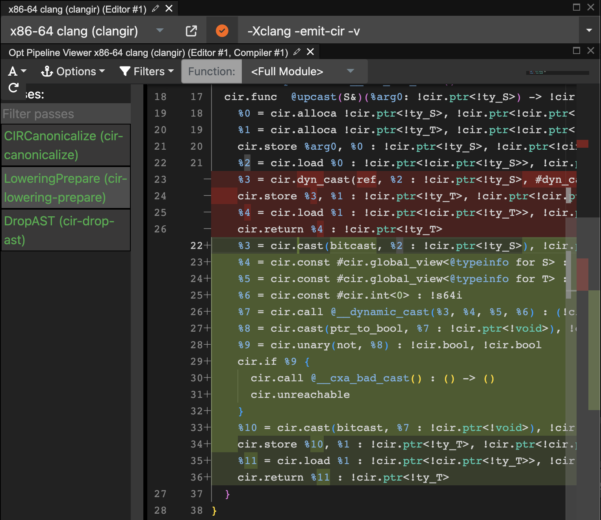
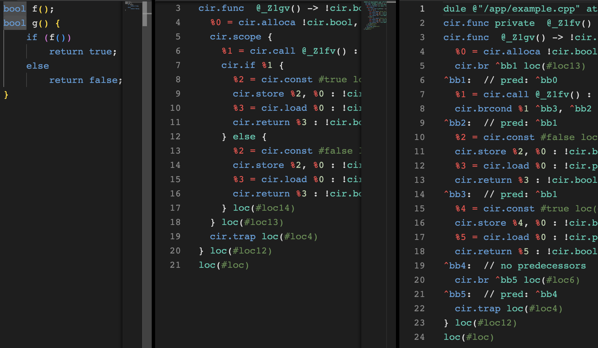

# Examples

## Enabling ClangIR

By default, Clang goes through its traditional CodeGen pipeline. After
you've [built a ClangIR-enabled Clang](build-install.html), you can
pass `-fclangir` to enable the ClangIR pipeline. [Godbolt](https://godbolt.org/z/9d8onnoT6)
also hosts a ClangIR-enabled compiler for quick experimentation.

## Emitting CIR

Pass `-S -Xclang -emit-cir` to Clang to emit CIR instead of assembly.
[Godbolt](https://godbolt.org/z/hsEbzEGnY) shows an example with various
language features and how they're translated to CIR.

## Viewing the pass pipeline

ClangIR runs its own pass pipeline. Some useful flags to introspect this
pipeline are:
* `-mmlir --mlir-print-ir-before-all` prints the CIR before each pass.
* `-mmlir --mlir-print-ir-after-all` prints the CIR after each pass.
* `-mmlir --mlir-print-ir-before=<pass>` and `-mmlir --mlir-print-ir-after=<pass>`
  print the CIR before and after a particular pass, respectively.

One particularly useful pass to introspect is `cir-lowering-prepare`
(LoweringPrepare), which goes from higher-level CIR constructs to
lower-level ones. Godbolt's [pipeline viewer](https://godbolt.org/z/1Ke8TKe7G)
is convenient for this.

## Emitting flat CIR

ClangIR tries to preserve high-level scope information till the end of
its pipeline, where it runs a flattening pass to convert to pure basic
block control flow. You can pass `-Xclang -emit-cir-flat` to see this
flattened representation. [Godbolt](https://godbolt.org/z/Gj336Yvos)
shows the difference in the representations.

## Generating LLVM IR

Pass `-fclangir -S -emit-llvm` to emit LLVM through the ClangIR
pipeline. [Godbolt](https://godbolt.org/z/KsGGWjEbq) shows an example.
All the standard Clang flags can be used as well, e.g. to
[build with optimizations](https://godbolt.org/z/4TvzrbnEn).

## Using the C++ lifetime-checker

### via clang driver
TBD

### via clang-tidy / clangd
TBD

